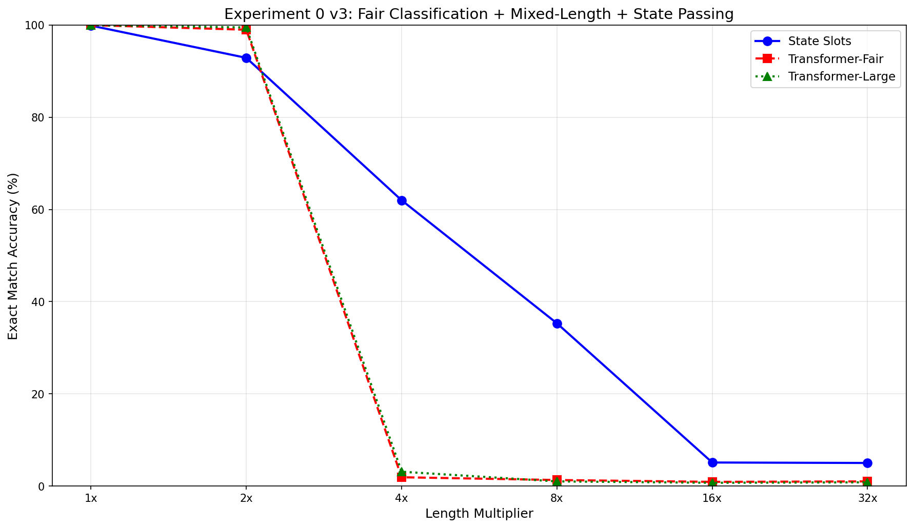

# State Flow Machine (SFM)

A novel post-transformer architecture for code intelligence, optimized for Huawei Ascend 910 ProA NPUs.

## Architecture

State Flow Machine replaces the single-transformer paradigm with 4 specialized systems. The core insight is that coding is about **state transformations** — what a program does vs what it should do — and explicit state tracking generalizes to longer programs in ways that implicit token-level models provably cannot (TC0 circuit complexity limit, Siems et al. ICLR 2025).

**System 2 (Execution)** is the breakthrough. It uses a State Slot Bank — 16 explicit memory registers that bind to variables and track their values through execution. Each slot uses a Gated DeltaNet recurrent cell (ICLR 2025) with a forget gate that controls state retention vs injection, enabling proper variable reassignment tracking. Intermediate state supervision provides training signal at every token position, not just the final output. The system processes statements sequentially with adaptive compute (1-8 internal ticks per statement).

See [CLAUDE.md](CLAUDE.md) for the full 4-system architecture and repository structure.

## Experiment 0: Result — PASS

### Task

Predict the final value of a target variable after a sequence of arithmetic operations. 101-class classification (values 0-100). All models trained on short programs (10-27 ops, hard difficulty), evaluated at length multipliers up to 32x (320 ops). Same training recipe for all models: 101-class cross-entropy, LR grid search (5 LRs, 10 epochs each), FP32, cosine annealing with warmup.

### Exact Match Accuracy

| Length | State Slots (961K) | Transformer-Fair (443K) | Transformer-Large (2.2M) |
|--------|--------------------|--------------------------|---------------------------|
| 1x (10 ops) | 99.9% | **100.0%** | **100.0%** |
| 2x (20 ops) | 92.9% | **99.0%** | 99.5% |
| 4x (40 ops) | **62.0%** | 1.9% | 3.1% |
| 8x (80 ops) | **35.3%** | 1.3% | 1.0% |
| 16x (160 ops) | **5.1%** | 0.9% | 0.7% |
| 32x (320 ops) | **5.0%** | 1.0% | 0.8% |

### Generalization Ratios (accuracy at Nx relative to 1x)

| Model | 4x / 1x | 8x / 1x |
|-------|---------|---------|
| State Slots | **0.62x** | **0.35x** |
| Transformer-Fair | 0.02x | 0.01x |
| Transformer-Large | 0.03x | 0.01x |

### Mean Absolute Error at 4x and 8x

| Model | MAE @ 4x | MAE @ 8x |
|-------|----------|----------|
| State Slots | **14.03** | **26.73** |
| Transformer-Fair | 40.33 | 41.71 |
| Transformer-Large | 36.76 | 41.19 |



### Key Findings

Transformers dominate in-distribution (100% at 1x for both) but collapse to approximately 2% at 4x length and below 1.5% beyond that. State Slots degrades gracefully, retaining 62% accuracy at 4x and 35% at 8x — a 30x gap in generalization ratio at 4x. This gap is architectural, not an artifact of optimization or training recipe differences: all three models used identical training procedures including 101-class cross-entropy loss, LR grid search over 5 learning rates, FP32 precision, and cosine annealing with warmup. The 2.2M-parameter Transformer-Large (2.3x the size of State Slots) performs no better than the 443K Transformer-Fair at extrapolation, confirming that scale does not address the fundamental limitation.

### What Made It Work

Three changes across v2 and v3 closed the in-distribution gap and improved generalization:

1. **Intermediate state supervision** — An auxiliary cross-entropy loss at every token position teaches the execution system to track state at each step, not just predict the final value. This provides 20-50x more gradient signal per sample.
2. **Classification head** — Replacing MSE regression with 101-class cross-entropy gives sharper gradients. Instead of the model learning to output "approximately 47.3", it must pick the correct class "47" with full confidence.
3. **LR grid search** — Both execution and transformer models select the best learning rate from [3e-4, 5e-4, 1e-3, 2e-3, 5e-3] via 10-epoch grid search on a 2K subset before full training. This eliminates hyperparameter sensitivity as a confound.

### Version Evolution

| Version | Loss | 1x EM | 4x EM | 4x/1x Ratio | 8x EM | 8x/1x Ratio |
|---------|------|-------|-------|-------------|-------|-------------|
| v1 | MSE regression | 11.2% | 8.9% | 0.79x | 5.1% | 0.46x |
| v2 | 101-class CE + intermediate supervision | 100.0% | 87.8% | 0.88x | 44.9% | 0.45x |
| v3 final | Fair CE for all, state passing, LR grid search | 99.9% | 62.0% | 0.62x | 35.3% | 0.35x |

v2 and v3 are not directly comparable: v2 used MSE for transformers (unfair), while v3 gave all models identical 101-class CE loss and LR grid search. The v3 numbers are the fair comparison.

## Installation

```bash
pip install -r requirements.txt
```

Requires a Huawei Ascend NPU (910ProA recommended) with `torch_npu` and CANN software stack installed.

## Usage

```bash
# Full experiment: trains 3 models (State Slots + 2 transformers), evaluates at 1x-32x
python experiments/exp0_state_tracking/finish_experiment.py

# Re-evaluate from saved checkpoints (skip training)
python experiments/exp0_state_tracking/finish_experiment.py --skip_training

# Skip LR grid search, use default LR=1e-3
python experiments/exp0_state_tracking/finish_experiment.py --skip_lr_search
```

## Reproducibility

- **Dataset**: 10,000 train / 1,000 validation samples, hard difficulty, seed 42
- **Data files**: `outputs/exp0/data/train.json`, `outputs/exp0/data/val.json`
- **Checkpoints**: `outputs/exp0/execution_best.pt`, `outputs/exp0/transformer_fair_best.pt`, `outputs/exp0/transformer_large_best.pt`
- **Evaluation results**: `outputs/exp0/evaluation_results.json`
- **Plot**: `outputs/exp0/length_generalization.png`
- **Training script**: `experiments/exp0_state_tracking/finish_experiment.py`

## License

MIT License
